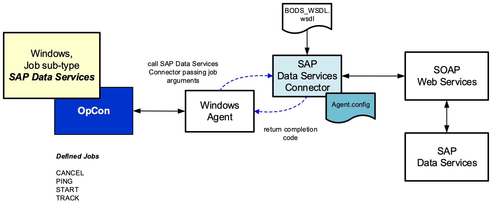

# SAP DataServices Implementaion

The current connector implementation consists of a Windows batch program that is executed by the Windows Agent, see figure below. The job definitions are entered as Windows jobs using the SAP DataServices job subtype. When the job is scheduled by OpCon, the definitions are passed as arguments to the SAP DataServices Connector.

 

The SAP DataServices Connector supports the following job types **CANCEL**, **PING**, **START** and **TRACK** which can used be used to communicate with the SAP DataServices batch environment.

* **PING** job type can be used to test a connection to SAP DataServices environment.
* **CANCEL** job type can be used to cancel a running batch job.
* **START** job can be used to start a batch job defined within the SAP DataServices environment.
* **TRACK** job type can be used to monitor a job executing within the SAP DataServices environment started by the SAP DataServices Scheduler. 

The job definitions are passed to the SAP DataServices Connector as arguments. The connector uses the BODS_WSDL.wsdl definition to define the web services end points. The job definition information received from OpCon is then mapped to the appropriate structures and the web service is called. Each job type apart from the PING job type requires a valid user and password which the connector uses to establish the connection to SAP DataServices. Once the connection is established, a security token is returned and this token is used on all subsequent calls to the web service until the job has completed. The security token is then discarded.
