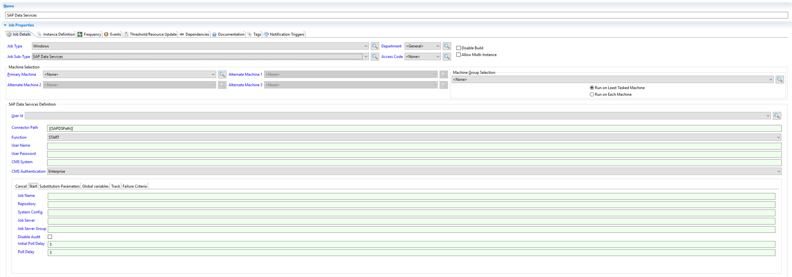

# SAP Data Services Subtype Installation

## Overview

After unzipping the SAP Data Services Connector package perform the following steps to install the SAPDS Sub-type.

## Installing the Sub-Type

1. Within ```<media>\SAPDataServices\emplugins``` directory, locate the jar file called: ```com.sma.ui.core.jobdetails.sapds_1.0.0.202009230702.jar```.
2. Copy the jar file from the DNA distribution directory, ```<media>:\SAPDataServices\emplugins``` into ```<media>:\OpConxps\EnterpriseManager x64\dropins``` folder.

:::note
These steps need to occur on every end user's machine that has access to Enterprise Manager to ensure their access to the sub-type.
:::

## Confirm the Sub-Type

To confirm that the sub-type is available for the end-user:

1. Launch Enterprise Manager
2. Create a new job with Windows for the Type
3. Confirm that "SAP Data Services" is in the job sub-type dropdown.



:::info note

You may have to launch Enterprise Manager as an Administrator the first time in order for the sub-type to show in the dropdown.
:::
