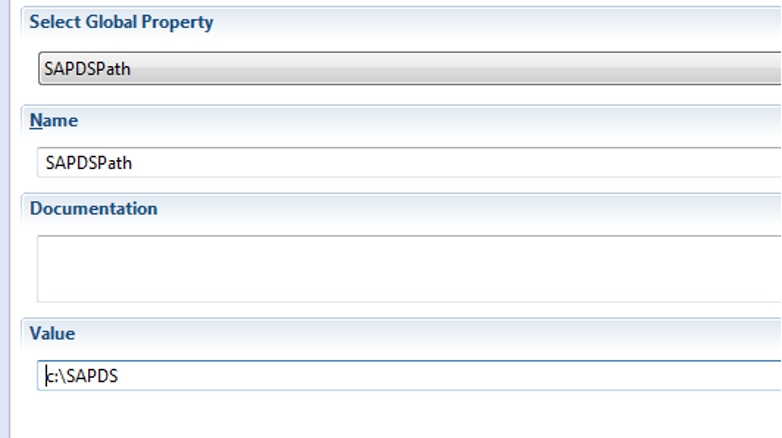

# SAP Data Services Global Property

The SAP Business Objects Connector jobs will utilize the path to the connector multiple times. It is best practice to set up a Global Porperty for this path.

## Global Property Set-up

Create a Global Property that points to the SAPDS directory that was created during the extraction process.

:::tip Example

For new implemntations, create a new Global Property with the path to SMARunDNAJob.exe as the value

**Name**: SAPDSPath

**Value**: ```C:\Program Files\OpConxps\SAPDS```


:::

