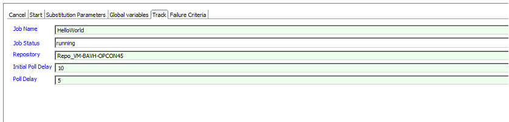

# Defining SAP Data Services Jobs using Enterprise Manager

## Overview

The Enterprise Manager includes job subtype definitions for the SAP Data Services Scheduler. The job subtype can be accessed by selecting the SAP Data Services job subtype from the drop down list when the Windows Job Type has been selected. 

It should be remembered that the SAP Data Services Connector does not create job definitions in the SAP Data Services database, but rather only uses existing job.

### Job Definition Screen

The Enterprise Manager includes job subtype definitions for the SAP Data Services Scheduler. The job subtype can be accessed by selecting the SAP Data Services job subtype from the drop down list when the Windows Job Type has been selected. 

It should be remembered that the SAP Data Services Connector does not create job definitions in the SAP Data Services database, but rather only uses existing job.

#### Connector Path

* Required field that contains the installed location of the SAP Data Services Connector. This should not be changed and the location should be defined in the BODSPath property. If more than one SAP Data Services Connectors is installed on the same system, then a new global property should be defined and the entry in this field updated.

#### Function

* Required field that contains the function to execute. Select CANCEL, PING, START or TRACK from the drop down list. Depending which function is selected, additional information can be entered in the appropriate TAB definition.

#### User Name

* Required field that contains the name of a SAP Data Services user that has the required privileges to execute the job.

#### User Password

* Required field that contains the password of the defined SAP Data Services user. When defining passwords, the encrypted global token capability should be used, which is decrypted by the Windows Agent and passed to the connector.

#### CMS System

* Required field that contains the name of the Central management Server associated with the SAP BODS installation

#### CMS Authentication

* Required field that contains authentication mode associated with the user defined in the User Name field. Select a value from the drop down list that matches your installation (Enterprise,LDAP, WinAD or SAPR3).

## SAP Data Services Job Definitions

### CANCEL

A CANCEL job type can be used to cancel a job running within the SAP Data Services environment. When the CANCEL job type is selected, the Cancel and Failure Criteria TABs are available for defining additional information with the Cancel TAB displayed. The CANCEL job type will cancel the last running job of the defined job name and in the defined repository.

#### Job Name
* Required field that contains the name of the job to cancel. The connector searches for the last job id that matches the defined job name and has a 'running' status.

#### Repository

* Required field that contains the name of the repository within which the job is defined.

### PING

A PING job type has no additional parameters and can be used to test the communications link between the SAP Data Services Connector and the SAP Data Services environment.

### START

A START job type can be used to start a job within the SAP Data Services environment. When the START job type is selected, the Start, Substitution Parameters, Global Variables and Failure Criteria TABs are available for defining additional information with the Start TAB displayed.

#### Job Name

* Required field that contains the name of the job to start.

#### Repository

* Required field that contains the name of the repository within which the job is defined.

#### System Config

* Defines a file that contains configuration information for a specific SAP Data Services installation. This value is mapped to the job_system_profile field.

#### Job Server

* Optional argument
* The name of a defined server on which the job should be executed. Argument mutually exclusive with Job Server Group field. Either Job Server or Job Server Group field must be present.

#### Job Server Group

* Optional argument
* The name of a defined Job Server Group on which the job should be executed. Argument mutually exclusive with Job Server field. Either Job Server or Job Server Group field must be present.

#### Initial Poll Delay

* Required argument that defines the initial poll delay when checking for the status of the job after the job has been started. This is a value in seconds.

#### Poll Delay

* Required argument that defines the poll delay between checking for the status of the job. This is a value in seconds.

### Global Variables

Global Variables TAB field definitions are used to pass global variables to the job to be started. The global variables are usually defined in SAP Data Services with a preceding dollar sign ($) (i.e. $Variable). 

:::note
It is **NOT** necessary to add the preceding $ when entering the field in the Global Variables Variable List.
:::

#### Add

* A button that is used to add a Global Variable to the Variable List. Enter a variable name in the Variable Name field and the value in the Value field and then select the Add button. 

#### Update

* A button that is used to update a Global Variable. Select the variable in the Variable List, modify the variable and then select the Update button. 

#### Remove

* A button that is used to remove a Global Variable from the Variable List. Select the variable in the Variable List and then select the Remove button.

### TRACK

A TRACK job type is used when it is necessary to check the status of a job running in the SAP Data Services environment that was not started by an OpCon START job type. When the TRACK Job Type is selected, the Track and Failure Criteria TABs are available for defining additional information with the Track TAB displayed.

#### Job Name

* Required field that contains the name of the job to track. The connector searches for the job id that matches the job name of the lastest job which is in a running state.

#### Job Status

* Required field that contains the status of the job. While various values can be selected from the drop down list, when tracking a job the 'running' status should be selected.

#### Repository

* Required field that contains the name of the repository within which the job is defined.

#### Initial Poll Delay

* Required argument that defines the initial poll delay when checking for the status. This is a value in seconds.

#### Poll Delay

* Required argument that defines the poll delay between checking for the status of the job. This is a value in seconds.

### Failure Criteria

The CANCEL, PING, START and TRACK job types require a Failure Criteria definition. A SAP Data Services Scheduled task has the following possible return codes:

    0	FINISHED_OK, the job completed processing.
    1	ERRORED, an exception occurred during job processing.

This means that to check for a successful completion, the Failure Criteria should be set to NE (Not Equal) to 0. It should be noted that a returned code from SAP Data Services of warning, will be logged and mapped to an ERRORED condition.

